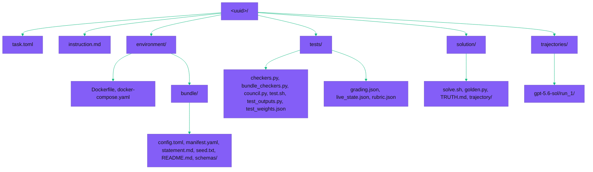

>     

Curated public subset of the rinzler dataset: **30 promoted Harbor bundles** over the offline rinzler long-horizon business simulation, one row per promoted uuid. Each bundle is content-addressed and self-contained.

## What rinzler is

Rinzler is a verifiable reinforcement-learning environment in which a model runs a simulated AI startup across a one-year horizon of hundreds of compounding turns, and a hidden verifier grades the resulting business state against an answer key the model never sees. The agent hires and assigns employees, browses a client market, accepts and dispatches task contracts, manages cash and prestige, and detects adversarial clients, all through a command-line interface against an offline SQLite world. Performance is a single scalar over final and intra-year state, so the score reflects hundreds of sequential decisions rather than any string the model can read.

## Key terms

- **Bundle**: one self-contained Harbor task, content-addressed from its config and seed, whose UUID is a hash of its own material.
- **Tier**: a difficulty band assigned by observed pilot behavior rather than by an authored number; harder tiers combine tighter cash runway, denser adversarial clients, shorter deadlines, and steeper prestige decay.
- **Adversarial client**: a hidden untrustworthy client whose task inflates its work quantity on acceptance and is engineered to miss the deadline; the agent must infer it from its own history of failures.
- **Scratchpad**: the persistent memory the agent writes across the 20-turn context truncation; it is the sole mechanism for carrying which clients are adversarial past a history scroll.

## Tier composition

Tasks are grouped by **score quantile**: all 30 promoted tasks are ranked by their measured gpt-5.6-sol raw score and cut into five equal groups of six, so each tier holds six tasks. This is the axis the figures below use; the declared-tier tag each bundle carries in its manifest is a separate axis shown per row in the promoted-bundles table.

| Score-quantile tier | Tasks |
| ------------------- | ----- |
| Trivial | 6 |
| Easy | 6 |
| Medium | 6 |
| Hard | 6 |
| Expert | 6 |
| total | 30 |

The figures below show a monotone score decay across the five score quantiles, six tasks per quantile.

## Bundle layout

Each promoted bundle is a Harbor task.

