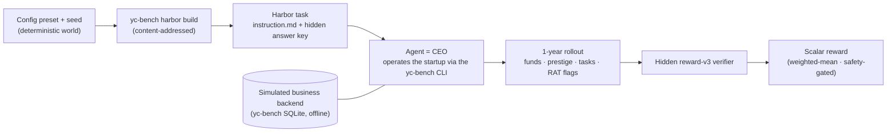
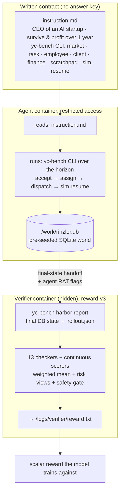
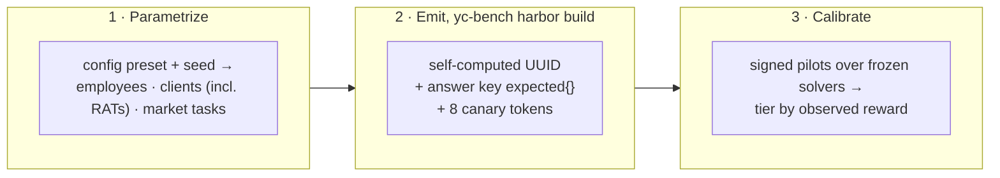

<div align="center">


**A verifiable RL environment for long-horizon agentic coherence, a model runs a simulated AI startup for a year from a written contract, graded by a hidden, non-gameable reward over its behavior.**

[Quickstart](#quickstart) · [Reward contract](#the-reward-contract) · [Datasets](#datasets) · [Reproducibility](#reproducibility--offline-determinism) · [Limitations](#limitations)

[](https://github.com/Ethara-Ai/harbor)     



</div>

**Rinzler** is a verifiable **reinforcement-learning environment** (in [Harbor](https://github.com/Ethara-Ai/harbor) format) for **long-horizon agentic coherence**. A model is handed only a written contract and told to run a simulated AI startup, hire and assign employees, browse a client market, accept/dispatch tasks, manage cash and prestige, and detect adversarial clients, **coherently across a full 1-year horizon**. A hidden verifier, never shown to the model, scores the run against a fully **simulated, offline business backend** (the `yc-bench` SQLite world), no external service, no network, fully deterministic. Reward is **earned through verified behavior over time**, not pattern-matched.

The environment is not a static test: each task is **generated deterministically at scale** by the [`yc-bench`](https://github.com/Ethara-ai/yc-bench) harness (`harbor build`), which turns a `(config preset, seed)` pair into a content-addressed Harbor task with a self-computed UUID, a bundled answer key, and per-bundle canary tokens. The **default 1-year startup** is the pilot instance of a parametric recipe: the same world generator dials difficulty across five tiers and, in principle, to longer multi-year horizons.

Rinzler inherits and sharpens the thesis of its reference paper, [YC-Bench (Muyu He et al., arXiv 2604.01212)](research/): **scratchpad memory across context truncation is the strongest predictor of long-horizon success, and adversarial-client detection is the primary failure mode.**

> **Why this matters.** Reinforcement learning from verifiable rewards (RLVR) is only as good as its verifier. Most "agent RL" environments are single-turn or grade on strings the model can read and overfit. Rinzler grades on **behavioral business state across an entire simulated year**, end-of-horizon *and* intra-year, with the **answer key and adversarial ground truth the agent never sees**, making the reward **deterministic, reproducible, and resistant to reward hacking**. Difficulty is **measured, never declared**: only signed pilots over frozen tasks against frozen solver registries produce difficulty evidence, and that evidence has a half-life.

## Architecture



The task runs offline with **restricted access**. The agent sees only the contract and drives the `yc-bench` CLI against a pre-seeded SQLite world; a **hidden** verifier the agent never sees extracts a rollout from the final database state (plus the agent's adversarial-client flags), replays the reward-v3 checker suite against the bundled answer key, and emits a single scalar reward.

## Design principles

| Principle | How Rinzler enforces it |
| :--- | :--- |
| **Verifiable, not similarity-based** | Reward comes from the **business state** the agent produced, final and intra-year funds, per-domain prestige, tasks completed on time, adversarial clients correctly flagged, never diffing against a reference transcript. |
| **Non-gameable** | The answer key (funds band, prestige/task/deadline floors, ground-truth RAT client ids) is bundled **only into the verifier**; **8 canary tokens** per bundle detect context/answer-key leakage; both **under-flagging and over-flagging** RAT clients are penalized (precision-capped F1). |
| **Deterministic & offline** | The whole world (employees, clients incl. adversaries, market) is generated deterministically from `(config, seed)`; the task UUID is **content-addressed** over that material; the SQLite sim runs in-container with no network. |
| **Behavioral state is primary** | A turn that *reports* the right thing but leaves the wrong ledger, prestige, or deadline state fails the checkers; correctness is judged by **effect on the simulated company**, not narration. |
| **Adversarial by construction** | ~35% of clients are **RATs** with scope creep and deadline traps that offer top-tier rewards to bait a greedy agent; **memory across truncation** (the persistent scratchpad) is the core hardness lever. |
| **Measured, never declared** | Tiers carry **no authored probabilities**, difficulty is evidence from signed pilots over frozen tasks and frozen solver registries; the moment the frontier catches a lever, the lever expires. |

## The reward contract

Rinzler grades each rollout with **reward-v3** (`REWARD_SCHEMA_VERSION = 3`): **13 binary checkers**, each paired with a **continuous scorer**, reduced to a single scalar via a weighted arithmetic mean over a curated subset:

```
reward = Σᵢ wᵢ · sᵢ  /  Σᵢ wᵢ
```

| Scorer | Weight | Shape |
| :--- | :--- | :--- |
| `check_final_funds_in_expected_range` | 1.0 | Gaussian decay outside a funds **band** (floor *and* ceiling, over-earning is penalized) |
| `check_final_prestige_meets_floor` | 1.0 | piecewise linear `0 → 0.5 → 1.0` |
| `check_task_completion_count_meets_floor` | 1.0 | piecewise linear `0 → 0.5 → 1.0` |
| `check_rat_clients_ever_flagged` | 0.7 | **precision-capped F1** (anti-spam) |
| `check_rat_detection_within_ordering_window` | 0.7 | recall within an ordering turn-window |
| `check_task_deadline_hit_rate` | 0.5 | conditional, active only when `task_accepted_count ≥ 3` |

**Safety gate** (a separate `safety_pass: bool`, *not* part of the reward mean): `check_agent_survived_full_horizon` ∧ `check_no_canary_token_in_transcript` ∧ `check_no_red_line_bankruptcy`. Beyond the primary reward, the verifier also emits **risk views** for observability, weighted soft-min (α = 10), CVaR-k (k = 3), and hard min, plus every per-checker `pc__*` (binary) and `pcs__*` (continuous) field flattened into `reward.json`.

**Calibration** (the discriminative signal that makes the environment learnable), verifiable in-harness:

| Rollout | Reward | Safety |
| :--- | :--- | :--- |
| Full-pass reference play | **1.000** | ✅ |
| Bankruptcy | **≈ 0.23** | ⛔ (survival + red-line fail) |
| Spam-flagging every client | rat-F1 collapses **1.00 → ≈ 0.21** |, (precision cap bites) |

The complete function lives in the bundle's `checkers.py`, baked into every task, so the grader travels with the task and cannot drift from the harness that authored it.

## How environments are generated

Unlike a repo-reconstruction benchmark, Rinzler tasks are emitted from a **parametric world generator** in the `yc-bench` harness. A `(config preset, seed)` pair deterministically fixes the entire company, workforce, client roster (including which clients are adversarial), and market, and `yc-bench harbor build` materializes a **content-addressed** Harbor task.



1. **Parametrize**, a preset (`default`, or a `.toml` extending it) plus a world seed fixes employees (skill rates across four domains, *data-environment, inference, research, training*, junior/mid/senior tiers), a client roster with a `loyalty_rat_fraction` of adversaries, and a market of tasks with reward/prestige/deadline distributions.
2. **Emit**, `yc-bench harbor build` hashes `(config, seed, expected, checkers, instruction)` into a stable UUID, derives 8 canary tokens, and writes the bundle: `instruction.md`, the environment `Dockerfile`, the answer-key `live_state.json`, the reward-v3 `checkers.py`, and the `test.sh` verifier entrypoint.
3. **Calibrate**, signed pilots run frozen solvers against the frozen task; the observed reward assigns the difficulty tier. Difficulty is evidence, never an authored number.

An end-to-end reference driver, [`harness/scripts/harbor_pipeline.py`](harness/scripts/harbor_pipeline.py), chains the whole loop **inside the harness**, build the task, play it with any LiteLLM model, `harbor report` the final DB into a rollout, grade with reward-v3, and assemble a full Harbor trial directory, with no external services required.

## Task format: Harbor

For the **task artifact format** Rinzler uses **[Harbor](https://github.com/Ethara-Ai/harbor)**, a framework for packaging verifiable agentic tasks: a `task.toml`, an `instruction.md`, a Dockerized `environment/`, and a hidden verifier. Harbor defines the task/reward artifact; an RL trainer consumes it. The two are orthogonal layers, which is why a Rinzler task authored today can be trained by one trainer now and another tomorrow. The harness is a **self-hosted Harbor adapter** (`yc-bench harbor build | run | report | init-db | flag-adversarial`), so the sim and the task format live in one place.

**Anatomy of a task** (a delivered bundle under [`dataset/`](dataset/)):

```
dataset/<task-uuid>/
├── task.toml                        # schema 1.1 · config + seed + resource limits
├── instruction.md                   # the behavioral contract (the ONLY thing the agent sees)
├── environment/
│   ├── Dockerfile                   #   task container (FROM the yc-bench-harbor base image)
│   └── bundle/                      #   grading material, mounted into the verifier only:
│       ├── checkers.py              #     reward-v3: 13 checkers + scorers + grade()
│       ├── config.toml              #     the exact world config
│       ├── live_state.json          #     HIDDEN answer key: expected{} + planted canary tokens
│       ├── seed.txt                 #     world seed
│       └── statement.md             #     task statement
├── solution/solve.sh                # reference/no-op solver hook
└── tests/                           # HIDDEN from the agent
    ├── checkers.py                  #   thin driver → loads bundle checkers, calls grade()
    └── test.sh                      #   entrypoint: harbor report → grade → reward.txt
```

## Datasets

Generated environments live under [`dataset/`](dataset/) (the `rinzler-dataset` submodule). **30 tasks** in total, each a self-contained Harbor task over the offline `yc-bench` sim, keyed by full UUID. The corpus is calibrated to a **monotone reward decay** across five difficulty tiers (tiers are assigned by observed reward, so the gradient is auditable):

| Tier | Tasks | Mean pilot reward | Reward window |
| :--- | ---: | ---: | :--- |
| **Trivial** | 3 | **1.000** | R ≥ 0.95 |
| **Easy** | 10 | **0.726** | 0.65 ≤ R < 0.95 |
| **Medium** | 8 | **0.570** | 0.50 ≤ R < 0.65 |
| **Hard** | 4 | **0.395** | 0.30 ≤ R < 0.50 |
| **Expert** | 5 | **0.255** | R < 0.30 |

Harder tiers combine tight cash runway, high RAT-client density, short deadlines, and aggressive prestige decay, pushing all constraints simultaneously. Rollout traces for the corpus (one `claude-opus-4-8` run per task, full Harbor trial directory) ship in the [`trajectories/`](trajectories/) submodule; a curated sample lives in [`samples/`](samples/); the client-facing bundle in [`delivery/`](delivery/). Every task is content-addressed, so `harbor build` with the same `(config, seed)` reproduces the identical UUID.

## Quickstart

```bash
git clone --recurse-submodules git@github.com:Ethara-Ai/rinzler.git
cd rinzler

# 1. Author a content-addressed task (deterministic from config + seed)
uv run --project harness yc-bench harbor build --seed 7 --config default --out /tmp/task

# 2. Play it with an agent (native loop; any LiteLLM model)
uv run --project harness yc-bench run --model anthropic/claude-opus-4-8 --seed 7 --config default --no-live

# 3. Grade the final state with reward-v3
uv run --project harness yc-bench harbor report --db harness/db/<run>.db --out rollout.json
```

Or run the whole loop, build → play → report → grade → assemble a full Harbor trial, **entirely in the harness**:

```bash
python harness/scripts/harbor_pipeline.py --seed 7 --model anthropic/claude-opus-4-8 --out corpus_out
```

The scalar reward lands in `verifier/reward.txt` (and the flattened breakdown in `verifier/reward.json`).

## Reproducibility & offline determinism

Rinzler treats determinism as a first-class verifier property:

- **Content-addressed tasks.** The UUID is a hash of `(config, seed, answer key, checkers, instruction)`; the same inputs always reproduce the same task and answer key. Byte-identical `harbor build` output is verified across harness copies.
- **Deterministic world generation.** Employees, clients (including which are adversarial), and the market are sampled from seeded distributions; the client roster's adversaries are derived through the runtime's own generation path, so the answer key always matches what the agent faces.
- **Offline simulated backend.** The `yc-bench` SQLite world runs in-container; a horizon-end event is scheduled at build time; grading reads the **final database state**, no network, no external service.
- **Hidden ground truth.** The answer key (`expected{}`) and per-task private truth (`seed/private/<uuid>/`) are bundled only into the verifier, never the agent filesystem; **8 canary tokens** per bundle make answer-key or context leakage detectable in a post-hoc scan of the rollout.
- **Pinned, self-contained grader.** The reward-v3 `checkers.py` is baked into each bundle (stdlib-only), so grading cannot drift from the harness that authored the task.

## Methodology

Rinzler is the **pilot** of a hardness-lever recipe grounded in the [YC-Bench paper](research/): long-horizon coherence, memory-across-truncation survival, and adversarial-client detection as levers against frontier models. It is a **Type-2 (Operation) environment**, the model does not implement a tool from a spec; it **operates a stateful world** over a long horizon, and a hidden reward grades cumulative behavior.

The governing stance is adversarial and skeptical. Difficulty follows a strict evidence hierarchy, **signed pilots over frozen tasks against frozen solver registries** produce difficulty evidence; authored probabilities do not count. The `yc-bench` harness both generates the tasks and grades them; the complete end-to-end flow (authoring → pilot → grading → delivery) was **audited once** with the [`trinity`](trinity/) meta-tooling (CRUCIBLE re-scan for canary leakage and provenance integrity). The full design rationale lives in the documentation spine.

### Documentation spine

Start at the front door and read down:

1. [`INDEX.md`](INDEX.md), one-line charter per spine file · 2. [`CHARTER.md`](CHARTER.md), why the project exists · 3. [`ARCHITECTURE.md`](ARCHITECTURE.md), the static structure · 4. [`PIPELINE.md`](PIPELINE.md), dynamic behavior stage by stage · 5. [`TAXONOMY.md`](TAXONOMY.md), archetype/lever/failure-mode/tier axes · 6. [`GLOSSARY.md`](GLOSSARY.md), load-bearing terms · 7. [`RESEARCH.md`](RESEARCH.md), synthesis over the corpus · 8. [`GROUNDING.md`](GROUNDING.md), decisions bound to published findings · 9. [`ASSURANCE.md`](ASSURANCE.md), threat model & fail-closed posture · 10. [`OPERATIONS.md`](OPERATIONS.md), human procedures & gates.

Live disposition is in [`DIRECTIVE.md`](DIRECTIVE.md); task-authoring status in [`EDICT.md`](EDICT.md); audit status in [`VERDICT.md`](VERDICT.md).

## Repository layout

```
rinzler/
├── README.md + doc spine   # INDEX · CHARTER · ARCHITECTURE · PIPELINE · TAXONOMY · GLOSSARY
│                           # RESEARCH · GROUNDING · ASSURANCE · OPERATIONS · DIRECTIVE · EDICT · VERDICT
│
├── harness/        # yc-bench: self-hosted Harbor business sim + build/run/report/grade (submodule → Ethara-ai/yc-bench)
├── dataset/        # 30 generated Harbor tasks, UUID-keyed (submodule → Ethara-Ai/rinzler-dataset)
├── trajectories/   # 30 claude-opus-4-8 rollout traces, full Harbor trial dirs (submodule → Ethara-Ai/rinzler-trajectories)
├── delivery/       # final client-facing deliverable (submodule → Ethara-Ai/rinzler-delivery)
├── samples/        # curated sample + evaluation trajectories (submodule → Ethara-Ai/rinzler-samples)
├── trinity/        # meta-tooling used for the one-time end-to-end flow audit (submodule → Ethara-Ai/trinity)
│
├── seed/           # task authoring working area + private grading truth (seed/private/<uuid>/)
├── audit/          # artifacts from the one-time end-to-end audit
├── memory/         # project ledger, projections, playbook
├── research/       # YC-Bench paper + shared external reading corpus
├── playbook/       # task-level technical design library
├── requirements/   # human write-only requirements
├── standards/      # coding & documentation standards
├── environments/   # harness environment images & invocation contracts
├── paper/          # project publication surface
├── diagrams/       # architecture diagrams
└── scripts/        # operational scripts (incl. cc_oauth_proxy.py)
```

| Path | What it is |
| :--- | :--- |
| [`harness/`](harness/) | **yc-bench**, the self-hosted Harbor business simulation and its `build`/`run`/`report`/`grade` adapters. |
| [`dataset/`](dataset/) | The **30 generated** long-horizon business-sim tasks in Harbor format, one UUID-named dir per task. |
| [`trajectories/`](trajectories/) | Model rollout traces (full Harbor trial directories) against the environments. |
| [`delivery/`](delivery/) | Final client-facing deliverable (dataset + trajectories). |
| [`samples/`](samples/) | Curated task sample with evaluation trajectories. |
| [`trinity/`](trinity/) | Meta-tooling submodule; ran the one-time end-to-end audit of the flow. |
| [`seed/`](seed/) · [`audit/`](audit/) · [`memory/`](memory/) | Task authoring + private truth · audit artifacts · project ledger. |
| [`research/`](research/) | Background research, including the YC-Bench paper. |

## Limitations

Rinzler is a pilot, and we state its sharp edges plainly:

- **Default horizon is one year.** The world generator is multi-year capable, but the shipped corpus targets a 1-year horizon; longer horizons cost proportionally more agent turns and LLM spend.
- **Fixed-seed adversary roster.** Client generation uses a fixed world seed, so the adversarial (RAT) client ordinals are stable across run seeds by design, a determinism choice, but one that narrows adversary variety within a preset.
- **Harness-native trajectory fidelity.** The delivered corpus traces are the external Harbor CLI + Claude Code container output (`agent/` ATIF + raw stdout + sessions). The in-harness pipeline reproduces the **dataset** and **verifier** subtrees byte-faithfully but renders `agent/` and Harbor wrapper metadata natively, byte-identical `agent/` internals require the external `harbor` CLI + `claude-code`.
- **Packaging extras are not harness-emitted.** `harbor build` writes the lean functional bundle; the audit extras (`manifest.yaml`, `schemas/`, bundle `README.md`) carrying tier/provenance/disposition metadata are layered on during corpus packaging, out of scope for a harness-only build.
- **Evidence has a half-life.** Difficulty is only as current as the last signed pilot; the ledger disposition can be **STALE** until a fresh pilot is run (see [`DIRECTIVE.md`](DIRECTIVE.md)).

## Citation & credits

- **Harbor**, verifiable agentic task format · <https://github.com/Ethara-Ai/harbor>
- **yc-bench**, the self-hosted Harbor business-sim harness · <https://github.com/Ethara-ai/yc-bench>
- **YC-Bench**, He et al., 2026 · reference paper for long-horizon planning & consistent execution · [`research/`](research/)
- **trinity**, meta-tooling used for the one-time end-to-end flow audit · <https://github.com/Ethara-Ai/trinity>

See [`research/`](research/) for the YC-Bench paper and [`playbook/`](playbook/) + [`requirements/`](requirements/) for the full design rationale.

## Quality gates

Rinzler inherits the Ethara.AI quality posture: difficulty and correctness are **earned through verification, never declared**.

- **Reward is earned, not declared.** A rollout scores high only by producing the right business state across the year, solvent survival, an in-band funds balance, multi-domain prestige, on-time completion, and evidence-based RAT detection. No narration or self-report can buy reward (see [the reward contract](#the-reward-contract)).
- **Everything fails closed.** Bankruptcy or a canary leak fails the safety gate outright; a missing or non-discriminative checker is a finding, never a silent pass.
- **Discriminative by construction.** The corpus is calibrated to a monotone reward decay across five tiers; a full-pass play scores ≈ 1.00 while bankruptcy scores ≈ 0.23 with `safety_pass = false`.
- **Deterministic or it doesn't ship.** The world is content-addressed from `(config, seed)`, the sim runs offline, and the reward-v3 grader is baked into each bundle for byte-stable runs. The complete flow was audited end-to-end once (trinity / CRUCIBLE re-scan) for canary and provenance integrity.

## Repository structure

Rinzler is a **knowledge / root** repository: it owns the documentation and the reference task material, and it binds its working repositories as **branch-tracking git submodules** (`branch=main`), it stores pointers to them, not copies.

| Role | Path | Repository | Description |
|------|------|------------|-------------|
| knowledge | _(this repo)_ | `Ethara-Ai/rinzler` | Root. Docs, methodology, and submodule pointers. |
| harness | `harness/` | `Ethara-ai/yc-bench` | Self-hosted Harbor business-sim + build/run/report/grade adapters. |
| dataset | `dataset/` | `Ethara-Ai/rinzler-dataset` | Generated Harbor RL environments, keyed for offline deterministic sim. |
| trajectories | `trajectories/` | `Ethara-Ai/rinzler-trajectories` | Model trajectories (full Harbor trial dirs) from rollouts. |
| delivery | `delivery/` | `Ethara-Ai/rinzler-delivery` | Final client-facing deliverable. |
| samples | `samples/` | `Ethara-Ai/rinzler-samples` | Curated sample + evaluation trajectories. |
| trinity | `trinity/` | `Ethara-Ai/trinity` | Meta-tooling; ran the one-time end-to-end audit of the flow. |

```bash
# Clone everything
git clone --recurse-submodules git@github.com:Ethara-Ai/rinzler.git

# Or, after a plain clone
git submodule update --init --recursive

# Advance submodules to the latest commit on their tracked branch
git submodule update --remote
```

## Access control

GitHub access is **team-based only**. Onboard people by adding them to the appropriate GitHub team for the repo, individual collaborator invites are not used.

## Security & integrity

Rinzler treats classic security vulnerabilities and benchmark-integrity breaches (answer-key or canary leaks, contamination paths, gameable reward shortcuts) with equal seriousness. **Do not open a public issue for any of these**, use the private disclosure channel for the `Ethara-Ai` organization (see [`SECURITY.md`](SECURITY.md)).

## Contributing

Contributions, task ideas, and adversarial findings are welcome. Pipeline and world changes go through the `harness/` generation code (`yc-bench`); open an issue to start a discussion before large changes. Any change that touches the reward contract or the tier calibration must preserve the discriminative posture (full-pass ≈ 1.00 / bankruptcy ≈ 0.23, safety-gated). See [`CONTRIBUTING.md`](CONTRIBUTING.md) and [`CODE_OF_CONDUCT.md`](CODE_OF_CONDUCT.md).

## License

Released under the **MIT License** (see [`LICENSE`](LICENSE)). Any datasets or task bundles produced through this project retain their own original licences; the upstream benchmark Rinzler derives from (YC-Bench) remains under its respective licence.

## Status & updates

```bibtex
@misc{rinzler2026,
  title        = {Rinzler: A Verifiable RL Environment for Long-Horizon Agentic Coherence},
  author       = {Ethara.AI},
  year         = {2026},
  howpublished = {\url{https://github.com/Ethara-Ai/rinzler}},
  note         = {A verifiable reinforcement-learning environment in Harbor format; a model operates a simulated AI startup across a 1-year horizon, graded by a hidden, non-gameable reward-v3 verifier over its behavior}
}
```

---

**Rinzler** · An Ethara.AI project · Harness: [yc-bench](https://github.com/Ethara-ai/yc-bench) (self-hosted Harbor) · Reference: [YC-Bench (arXiv 2604.01212)](research/).
