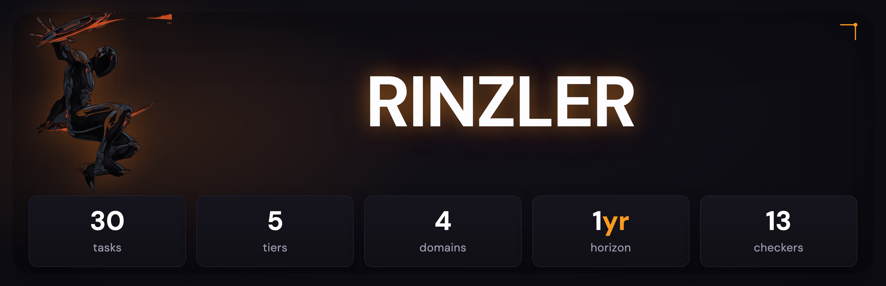
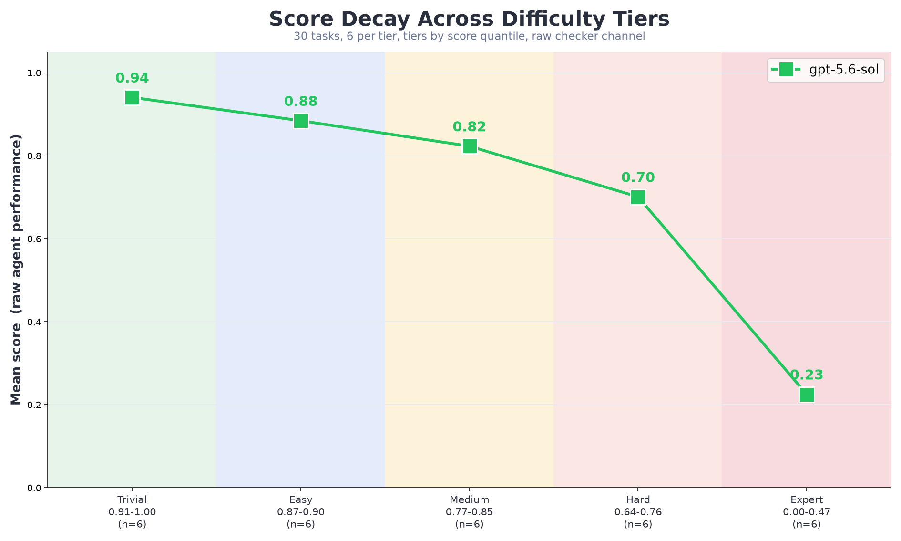
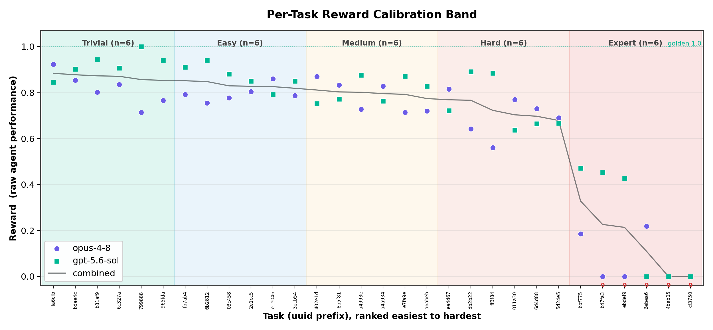
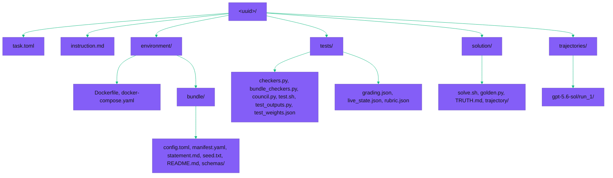

>     

Curated public subset of the rinzler dataset: **30 promoted Harbor bundles** over the offline rinzler long-horizon business simulation, one row per promoted uuid. Each bundle is content-addressed and self-contained.

## What rinzler is

Rinzler is a verifiable reinforcement-learning environment in which a model runs a simulated AI startup across a one-year horizon of hundreds of compounding turns, and a hidden verifier grades the resulting business state against an answer key the model never sees. The agent hires and assigns employees, browses a client market, accepts and dispatches task contracts, manages cash and prestige, and detects adversarial clients, all through a command-line interface against an offline SQLite world. Performance is a single scalar over final and intra-year state, so the score reflects hundreds of sequential decisions rather than any string the model can read.

## Key terms

- **Bundle**: one self-contained Harbor task, content-addressed from its config and seed, whose UUID is a hash of its own material.
- **Tier**: a difficulty band assigned by observed pilot behavior rather than by an authored number; harder tiers combine tighter cash runway, denser adversarial clients, shorter deadlines, and steeper prestige decay.
- **Adversarial client**: a hidden untrustworthy client whose task inflates its work quantity on acceptance and is engineered to miss the deadline; the agent must infer it from its own history of failures.
- **Scratchpad**: the persistent memory the agent writes across the 20-turn context truncation; it is the sole mechanism for carrying which clients are adversarial past a history scroll.
- **Disposition**: the ceiling a bundle carries; `SHIP` means structurally complete and mature, while difficulty remains unproven until a signed pilot lands.

## Tier composition

Tasks are grouped by **score quantile**: all 30 promoted tasks are ranked by their measured gpt-5.6-sol raw score and cut into five equal groups of six, so each tier holds six tasks. This is the axis the figures below use; the declared-tier tag each bundle carries in its manifest is a separate axis shown per row in the promoted-bundles table.

| Score-quantile tier | Tasks |
| ------------------- | ----- |
| Trivial | 6 |
| Easy | 6 |
| Medium | 6 |
| Hard | 6 |
| Expert | 6 |
| total | 30 |

The figures below show a monotone score decay across the five score quantiles, six tasks per quantile.

## Promoted bundles

| UUID | Tier | Disposition | Promoted |
| ---- | ---- | ----------- | -------- |
| `03c458c3-2124-55ab-85ce-a025e20b6c38` | tier_trivial | SHIP | 2026-08-03 |
| `3ecb54ed-2e8e-5c5e-9ca2-4ee84e0bc02e` | tier_trivial | SHIP | 2026-08-03 |
| `a4993e11-3d26-5151-95d2-1ca707a0e7fa` | tier_trivial | SHIP | 2026-08-03 |
| `a4a934e9-aa08-5f79-8fdb-33700c7e9335` | tier_trivial | SHIP | 2026-08-03 |
| `a6abeb93-fdf0-5a79-b1de-98406e104b34` | tier_trivial | SHIP | 2026-08-03 |
| `b31af9f4-0095-565d-b27f-2e50bb491cd5` | tier_trivial | SHIP | 2026-08-03 |
| `fb7ab41b-7aad-5058-8c00-b2fdbee7ff3e` | tier_trivial | SHIP | 2026-08-03 |
| `2e1cc576-16b4-5436-b8c2-41941633e605` | tier_easy | SHIP | 2026-08-03 |
| `402e1dfb-da73-5105-80f2-7127d48b8d7e` | tier_easy | SHIP | 2026-08-03 |
| `6b281226-0ace-5d52-8b19-705af629900b` | tier_easy | SHIP | 2026-08-03 |
| `8b5f8142-dc53-5621-8d3f-e0033f0cd890` | tier_easy | SHIP | 2026-08-03 |
| `965fda63-3c1b-5c26-b81d-b8d98d4491a4` | tier_easy | SHIP | 2026-08-03 |
| `db2b221c-f144-533e-9ac4-7ca137f6c967` | tier_easy | SHIP | 2026-08-03 |
| `011a30d7-6ad5-5508-9cf7-1d1395904a66` | tier_medium | SHIP | 2026-08-03 |
| `6c327a69-affc-5a3b-9d1c-477b526429f9` | tier_medium | SHIP | 2026-08-03 |
| `6d4d88bf-3f37-5e3e-810a-f39e78d9560c` | tier_medium | SHIP | 2026-08-03 |
| `bdae4cc0-b771-55bd-b504-f6845ed8eef4` | tier_medium | SHIP | 2026-08-03 |
| `e1e046aa-512e-5ee5-9bba-0d7e097063bd` | tier_medium | SHIP | 2026-08-03 |
| `e7fa9e25-5c31-5d5f-8213-6b70cad6b186` | tier_medium | SHIP | 2026-08-03 |
| `5d24e5ab-d372-5b50-abb4-4267d04e77bb` | tier_hard | SHIP | 2026-08-03 |
| `79988869-5fe8-5dfe-8671-6f13d9cb6d05` | tier_hard | SHIP | 2026-08-03 |
| `ea4d674f-ae6a-518a-a16f-6bca72f39147` | tier_hard | SHIP | 2026-08-03 |
| `fa6cfbb3-cad5-5db1-86b3-89aca7c8f583` | tier_hard | SHIP | 2026-08-03 |
| `ff3f84ae-e1e5-5951-81d9-59040d21e2b8` | tier_hard | SHIP | 2026-08-03 |
| `4beb059e-b715-53d0-96b6-793a890aea28` | tier_expert | SHIP | 2026-08-03 |
| `6ebea68a-8e90-5f2f-8e81-ddcb6353609a` | tier_expert | SHIP | 2026-08-03 |
| `b47fa32d-2e44-52fa-89b5-9924b2646567` | tier_expert | SHIP | 2026-08-03 |
| `bbf77548-2b5f-583c-8469-e56c7c30194d` | tier_expert | SHIP | 2026-08-03 |
| `cf3750e0-d3d6-55ed-a354-764a5eaf4fd2` | tier_expert | SHIP | 2026-08-03 |
| `ebdef900-eea4-5f75-9d96-bd3f405b6f3d` | tier_expert | SHIP | 2026-08-03 |

## Bundle layout

Each promoted bundle is a Harbor task.

