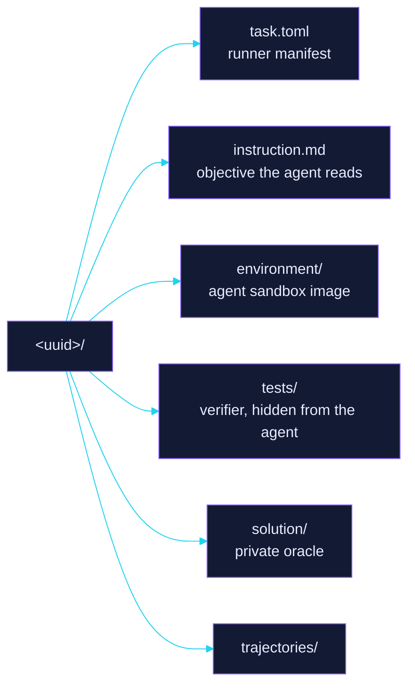
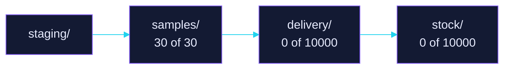

<p align="center"></p>

# Project: samples

<p align="center"><b>The samples lane: 30 of 30 Harbor task bundles.</b></p>

<p align="center"><a href="#summary"></a> <a href="#evidence-status"></a> <a href="#difficulty-tiers"></a></p>

<p align="center"><sub><a href="#abstract">Abstract</a> | <a href="#summary">Summary</a> | <a href="#difficulty-tiers">Difficulty tiers</a> | <a href="#evidence-status">Evidence status</a> | <a href="#coverage">Coverage</a> | <a href="#dataset-structure">Dataset structure</a> | <a href="#verification-and-quality-assurance">Verification and quality assurance</a> | <a href="#reproduction">Reproduction</a> | <a href="#cite">Cite</a> | <a href="#license">License</a> | <a href="#contact">Contact</a></sub></p>

## Abstract

The curated lane of this corpus: at most 30 Harbor task bundles, every anchor seated first and every other bundle in seal order. Bundles past that ceiling live in `delivery/`.

Each bundle is one Harbor task in a directory named by its content-derived uuid5, so the name doubles as an integrity check. This page is rendered from the resident bundles on every reconcile; a value a bundle does not carry reads `absent`, and the page never fills one in.

## Summary

| Property | Value |
| --- | --- |
| Bundles | 30 of 30 |
| Sealed | 0 of 30 |
| Registrations | unregistered (30) |
| Audit verdicts | none (30) |
| Harbor schema | 1.1 (30) |

## Difficulty tiers

Difficulty is measured by the signed pilot alone and never declared in a bundle, so this page states no tier a bundle claims.

## Evidence status

The verdict is the audit outcome recorded at the sealed digest, and `none` means no verdict has landed for that digest yet. Only an authoring run removes a bundle from this lane, so removal waits for the next one.

| uuid | Verdict | Sealed digest | Stream |
| --- | --- | --- | --- |
| 011a30d7-6ad5-5508-9cf7-1d1395904a66 | none | absent | none |
| 03c458c3-2124-55ab-85ce-a025e20b6c38 | none | absent | none |
| 2e1cc576-16b4-5436-b8c2-41941633e605 | none | absent | none |
| 3ecb54ed-2e8e-5c5e-9ca2-4ee84e0bc02e | none | absent | none |
| 402e1dfb-da73-5105-80f2-7127d48b8d7e | none | absent | none |
| 4beb059e-b715-53d0-96b6-793a890aea28 | none | absent | none |
| 5d24e5ab-d372-5b50-abb4-4267d04e77bb | none | absent | none |
| 6b281226-0ace-5d52-8b19-705af629900b | none | absent | none |
| 6c327a69-affc-5a3b-9d1c-477b526429f9 | none | absent | none |
| 6d4d88bf-3f37-5e3e-810a-f39e78d9560c | none | absent | none |
| 6ebea68a-8e90-5f2f-8e81-ddcb6353609a | none | absent | none |
| 79988869-5fe8-5dfe-8671-6f13d9cb6d05 | none | absent | none |
| 8b5f8142-dc53-5621-8d3f-e0033f0cd890 | none | absent | none |
| 965fda63-3c1b-5c26-b81d-b8d98d4491a4 | none | absent | none |
| a4993e11-3d26-5151-95d2-1ca707a0e7fa | none | absent | none |
| a4a934e9-aa08-5f79-8fdb-33700c7e9335 | none | absent | none |
| a6abeb93-fdf0-5a79-b1de-98406e104b34 | none | absent | none |
| b31af9f4-0095-565d-b27f-2e50bb491cd5 | none | absent | none |
| b47fa32d-2e44-52fa-89b5-9924b2646567 | none | absent | none |
| bbf77548-2b5f-583c-8469-e56c7c30194d | none | absent | none |
| bdae4cc0-b771-55bd-b504-f6845ed8eef4 | none | absent | none |
| cf3750e0-d3d6-55ed-a354-764a5eaf4fd2 | none | absent | none |
| db2b221c-f144-533e-9ac4-7ca137f6c967 | none | absent | none |
| e1e046aa-512e-5ee5-9bba-0d7e097063bd | none | absent | none |
| e7fa9e25-5c31-5d5f-8213-6b70cad6b186 | none | absent | none |
| ea4d674f-ae6a-518a-a16f-6bca72f39147 | none | absent | none |
| ebdef900-eea4-5f75-9d96-bd3f405b6f3d | none | absent | none |
| fa6cfbb3-cad5-5db1-86b3-89aca7c8f583 | none | absent | none |
| fb7ab41b-7aad-5058-8c00-b2fdbee7ff3e | none | absent | none |
| ff3f84ae-e1e5-5951-81d9-59040d21e2b8 | none | absent | none |

## Coverage

| Keyword | Bundles |
| --- | --- |
| business-sim | 30 |
| long-horizon | 30 |
| rinzler | 30 |

## Dataset structure

| Bundle | Task | Keywords | Registration | Sealed at | Tier |
| --- | --- | --- | --- | --- | --- |
| [`011a30d7-6ad5-5508-9cf7-1d1395904a66`](011a30d7-6ad5-5508-9cf7-1d1395904a66/) | `rinzler/011a30d7-6ad5-5508-9cf7-1d1395904a66` | business-sim, long-horizon, rinzler | unregistered | unsealed | - |
| [`03c458c3-2124-55ab-85ce-a025e20b6c38`](03c458c3-2124-55ab-85ce-a025e20b6c38/) | `rinzler/03c458c3-2124-55ab-85ce-a025e20b6c38` | business-sim, long-horizon, rinzler | unregistered | unsealed | - |
| [`2e1cc576-16b4-5436-b8c2-41941633e605`](2e1cc576-16b4-5436-b8c2-41941633e605/) | `rinzler/2e1cc576-16b4-5436-b8c2-41941633e605` | business-sim, long-horizon, rinzler | unregistered | unsealed | - |
| [`3ecb54ed-2e8e-5c5e-9ca2-4ee84e0bc02e`](3ecb54ed-2e8e-5c5e-9ca2-4ee84e0bc02e/) | `rinzler/3ecb54ed-2e8e-5c5e-9ca2-4ee84e0bc02e` | business-sim, long-horizon, rinzler | unregistered | unsealed | - |
| [`402e1dfb-da73-5105-80f2-7127d48b8d7e`](402e1dfb-da73-5105-80f2-7127d48b8d7e/) | `rinzler/402e1dfb-da73-5105-80f2-7127d48b8d7e` | business-sim, long-horizon, rinzler | unregistered | unsealed | - |
| [`4beb059e-b715-53d0-96b6-793a890aea28`](4beb059e-b715-53d0-96b6-793a890aea28/) | `rinzler/4beb059e-b715-53d0-96b6-793a890aea28` | business-sim, long-horizon, rinzler | unregistered | unsealed | - |
| [`5d24e5ab-d372-5b50-abb4-4267d04e77bb`](5d24e5ab-d372-5b50-abb4-4267d04e77bb/) | `rinzler/5d24e5ab-d372-5b50-abb4-4267d04e77bb` | business-sim, long-horizon, rinzler | unregistered | unsealed | - |
| [`6b281226-0ace-5d52-8b19-705af629900b`](6b281226-0ace-5d52-8b19-705af629900b/) | `rinzler/6b281226-0ace-5d52-8b19-705af629900b` | business-sim, long-horizon, rinzler | unregistered | unsealed | - |
| [`6c327a69-affc-5a3b-9d1c-477b526429f9`](6c327a69-affc-5a3b-9d1c-477b526429f9/) | `rinzler/6c327a69-affc-5a3b-9d1c-477b526429f9` | business-sim, long-horizon, rinzler | unregistered | unsealed | - |
| [`6d4d88bf-3f37-5e3e-810a-f39e78d9560c`](6d4d88bf-3f37-5e3e-810a-f39e78d9560c/) | `rinzler/6d4d88bf-3f37-5e3e-810a-f39e78d9560c` | business-sim, long-horizon, rinzler | unregistered | unsealed | - |
| [`6ebea68a-8e90-5f2f-8e81-ddcb6353609a`](6ebea68a-8e90-5f2f-8e81-ddcb6353609a/) | `rinzler/6ebea68a-8e90-5f2f-8e81-ddcb6353609a` | business-sim, long-horizon, rinzler | unregistered | unsealed | - |
| [`79988869-5fe8-5dfe-8671-6f13d9cb6d05`](79988869-5fe8-5dfe-8671-6f13d9cb6d05/) | `rinzler/79988869-5fe8-5dfe-8671-6f13d9cb6d05` | business-sim, long-horizon, rinzler | unregistered | unsealed | - |
| [`8b5f8142-dc53-5621-8d3f-e0033f0cd890`](8b5f8142-dc53-5621-8d3f-e0033f0cd890/) | `rinzler/8b5f8142-dc53-5621-8d3f-e0033f0cd890` | business-sim, long-horizon, rinzler | unregistered | unsealed | - |
| [`965fda63-3c1b-5c26-b81d-b8d98d4491a4`](965fda63-3c1b-5c26-b81d-b8d98d4491a4/) | `rinzler/965fda63-3c1b-5c26-b81d-b8d98d4491a4` | business-sim, long-horizon, rinzler | unregistered | unsealed | - |
| [`a4993e11-3d26-5151-95d2-1ca707a0e7fa`](a4993e11-3d26-5151-95d2-1ca707a0e7fa/) | `rinzler/a4993e11-3d26-5151-95d2-1ca707a0e7fa` | business-sim, long-horizon, rinzler | unregistered | unsealed | - |
| [`a4a934e9-aa08-5f79-8fdb-33700c7e9335`](a4a934e9-aa08-5f79-8fdb-33700c7e9335/) | `rinzler/a4a934e9-aa08-5f79-8fdb-33700c7e9335` | business-sim, long-horizon, rinzler | unregistered | unsealed | - |
| [`a6abeb93-fdf0-5a79-b1de-98406e104b34`](a6abeb93-fdf0-5a79-b1de-98406e104b34/) | `rinzler/a6abeb93-fdf0-5a79-b1de-98406e104b34` | business-sim, long-horizon, rinzler | unregistered | unsealed | - |
| [`b31af9f4-0095-565d-b27f-2e50bb491cd5`](b31af9f4-0095-565d-b27f-2e50bb491cd5/) | `rinzler/b31af9f4-0095-565d-b27f-2e50bb491cd5` | business-sim, long-horizon, rinzler | unregistered | unsealed | - |
| [`b47fa32d-2e44-52fa-89b5-9924b2646567`](b47fa32d-2e44-52fa-89b5-9924b2646567/) | `rinzler/b47fa32d-2e44-52fa-89b5-9924b2646567` | business-sim, long-horizon, rinzler | unregistered | unsealed | - |
| [`bbf77548-2b5f-583c-8469-e56c7c30194d`](bbf77548-2b5f-583c-8469-e56c7c30194d/) | `rinzler/bbf77548-2b5f-583c-8469-e56c7c30194d` | business-sim, long-horizon, rinzler | unregistered | unsealed | - |
| [`bdae4cc0-b771-55bd-b504-f6845ed8eef4`](bdae4cc0-b771-55bd-b504-f6845ed8eef4/) | `rinzler/bdae4cc0-b771-55bd-b504-f6845ed8eef4` | business-sim, long-horizon, rinzler | unregistered | unsealed | - |
| [`cf3750e0-d3d6-55ed-a354-764a5eaf4fd2`](cf3750e0-d3d6-55ed-a354-764a5eaf4fd2/) | `rinzler/cf3750e0-d3d6-55ed-a354-764a5eaf4fd2` | business-sim, long-horizon, rinzler | unregistered | unsealed | - |
| [`db2b221c-f144-533e-9ac4-7ca137f6c967`](db2b221c-f144-533e-9ac4-7ca137f6c967/) | `rinzler/db2b221c-f144-533e-9ac4-7ca137f6c967` | business-sim, long-horizon, rinzler | unregistered | unsealed | - |
| [`e1e046aa-512e-5ee5-9bba-0d7e097063bd`](e1e046aa-512e-5ee5-9bba-0d7e097063bd/) | `rinzler/e1e046aa-512e-5ee5-9bba-0d7e097063bd` | business-sim, long-horizon, rinzler | unregistered | unsealed | - |
| [`e7fa9e25-5c31-5d5f-8213-6b70cad6b186`](e7fa9e25-5c31-5d5f-8213-6b70cad6b186/) | `rinzler/e7fa9e25-5c31-5d5f-8213-6b70cad6b186` | business-sim, long-horizon, rinzler | unregistered | unsealed | - |
| [`ea4d674f-ae6a-518a-a16f-6bca72f39147`](ea4d674f-ae6a-518a-a16f-6bca72f39147/) | `rinzler/ea4d674f-ae6a-518a-a16f-6bca72f39147` | business-sim, long-horizon, rinzler | unregistered | unsealed | - |
| [`ebdef900-eea4-5f75-9d96-bd3f405b6f3d`](ebdef900-eea4-5f75-9d96-bd3f405b6f3d/) | `rinzler/ebdef900-eea4-5f75-9d96-bd3f405b6f3d` | business-sim, long-horizon, rinzler | unregistered | unsealed | - |
| [`fa6cfbb3-cad5-5db1-86b3-89aca7c8f583`](fa6cfbb3-cad5-5db1-86b3-89aca7c8f583/) | `rinzler/fa6cfbb3-cad5-5db1-86b3-89aca7c8f583` | business-sim, long-horizon, rinzler | unregistered | unsealed | - |
| [`fb7ab41b-7aad-5058-8c00-b2fdbee7ff3e`](fb7ab41b-7aad-5058-8c00-b2fdbee7ff3e/) | `rinzler/fb7ab41b-7aad-5058-8c00-b2fdbee7ff3e` | business-sim, long-horizon, rinzler | unregistered | unsealed | - |
| [`ff3f84ae-e1e5-5951-81d9-59040d21e2b8`](ff3f84ae-e1e5-5951-81d9-59040d21e2b8/) | `rinzler/ff3f84ae-e1e5-5951-81d9-59040d21e2b8` | business-sim, long-horizon, rinzler | unregistered | unsealed | - |


```mermaid
%%{init: {"theme":"base","themeVariables":{"primaryColor":"#131a33","primaryTextColor":"#e8ecff","primaryBorderColor":"#845EF7","lineColor":"#22d3ee","fontFamily":"monospace"}}}%%
flowchart LR
    bundle["&lt;uuid&gt;/"]
    bundle --> n0["task.toml<br/>runner manifest"]
    bundle --> n1["instruction.md<br/>objective the agent reads"]
    bundle --> n2["environment/<br/>agent sandbox image"]
    bundle --> n3["tests/<br/>verifier, hidden from the agent"]
    bundle --> n4["solution/<br/>private oracle"]
    bundle --> n5["trajectories/"]
```


```mermaid
%%{init: {"theme":"base","themeVariables":{"primaryColor":"#131a33","primaryTextColor":"#e8ecff","primaryBorderColor":"#845EF7","lineColor":"#22d3ee","fontFamily":"monospace"}}}%%
flowchart LR
    staging["staging/"]
    staging --> samples["samples/<br/>30 of 30"]
    samples --> delivery["delivery/<br/>0 of 10000"]
    delivery --> stock["stock/<br/>0 of 10000"]
```

## Verification and quality assurance

Each bundle's signed provenance carrier holds its screening roots, screening instant, and absolute expiry. Placement moves that carrier into the private derivation set, which this page never reads, so reconcile lists no root it cannot verify here.

## Reproduction

Each bundle directory is a complete Harbor task: `task.toml` is the runner manifest, `instruction.md` the objective, `environment/` the sandbox image, and `tests/` the verifier. Point a Harbor runner at one bundle directory to reproduce it; `solution/` stays private.

## Cite

```bibtex
@misc{rinzler2026,
  title        = {Rinzler: A Verifiable RL Environment for Long-Horizon Agentic Coherence},
  author       = {Ethara.AI},
  year         = {2026},
  howpublished = {\url{https://github.com/Ethara-Ai/rinzler}},
  note         = {A model operates a simulated AI startup across a 1-year horizon,
                  graded by a hidden, non-gameable score-v3 verifier over its behavior}
}
```

## License

Released under the MIT License; see [LICENSE](LICENSE). Copyright (c) 2026 Ethara.AI. Datasets and task bundles retain their own upstream licences; YC-Bench remains under its respective licence.

## Contact

- Organization: [Ethara.AI](https://github.com/Ethara-Ai)
- Security and benchmark-integrity disclosure: see [SECURITY.md](SECURITY.md) (do not open public issues for leaks, contamination, or gameable shortcuts)
- Contribution route: [CONTRIBUTING.md](CONTRIBUTING.md)
